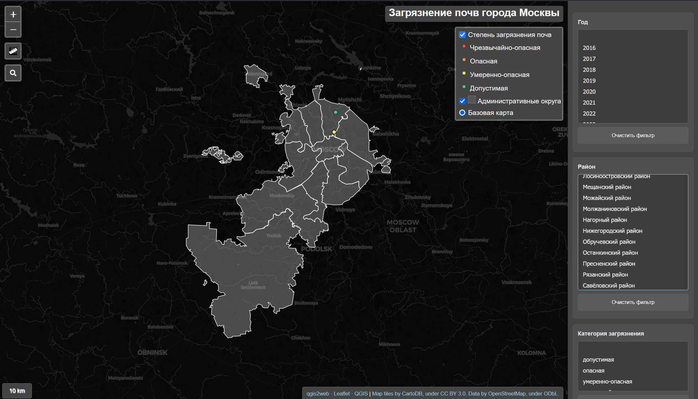

# Загрязнение почв города Москвы

## Описание

Интерактивная веб-карта, созданная с использованием плагина qgis2Web и библиотеки Leaflet, отображающая данные о загрязнении почв в городе Москве. Проект предоставляет визуализацию геопространственных данных с возможностью фильтрации, измерения расстояний и взаимодействия с картографической информацией.

## Скриншоты

*Главная страница приложения с интерактивной картой*

## Использование

1. Откройте `index.html` в веб-браузере
2. Используйте элементы управления слоями в верхнем левом углу для переключения видимости данных
3. Используйте инструмент измерения для определения расстояний
4. Взаимодействуйте с объектами на карте для просмотра подробной информации
5. Используйте фильтры для отображения конкретных данных

## Требования

- Современный веб-браузер с поддержкой:
  - HTML5
  - CSS3
  - JavaScript (ES6+)
  - WebGL (опционально, для некоторых функций)

## Совместимость браузеров

- Chrome/Chromium 90+
- Firefox 88+
- Safari 14+
- Edge 90+

## Автор

Создано с использованием QGIS2Web

## Лицензия

Проект использует следующие открытые библиотеки:
- Leaflet (BSD 2-Clause License)
- QGIS (GPL v2 License)
- Font Awesome (CC BY 4.0 License)

